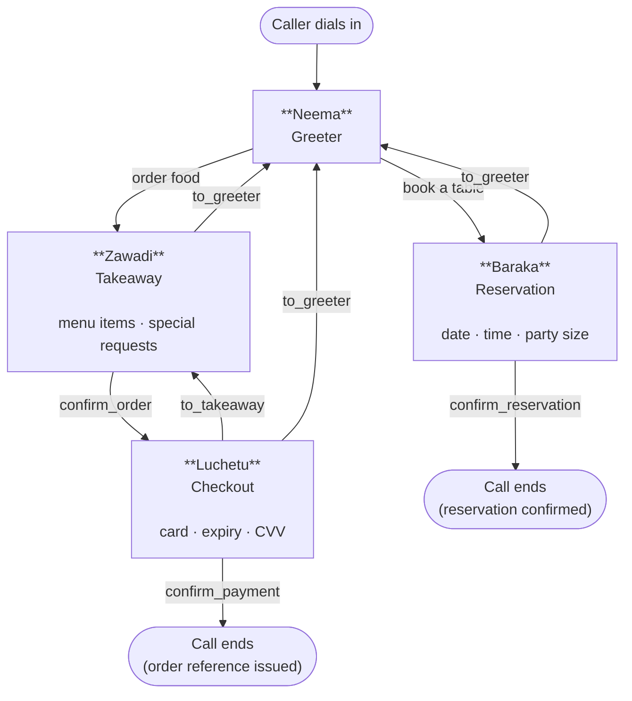

# Conversation Flow

Every call starts with Neema and ends when the caller hangs up or a session limit is
reached. Between those two points, the call takes one of two paths depending on what the
caller wants. The paths can combine — a caller can book a table and then order food in the
same call — and any agent can send the caller back to Neema at any point.

---

## The Two Paths

---

## Before Neema Speaks

Before any agent says a word, the system classifies the caller's first utterance. This
happens in `src/core/intent_router.py` the moment audio is received.

If the classifier is confident about what the caller wants, it either skips Neema and
opens the right specialist directly, or injects a hint into Neema's system prompt so she
can route without asking. When confidence is low, Neema handles the call from scratch.

Full details are in [Intent Routing](./03-intent-routing). The point here is that Neema
may already know why someone is calling before she says hello.

---

## Stage by Stage

### 1. Greeting

Neema answers. Her greeting is shaped by two things:

- **Who is calling.** If the caller's name is already in session state, Neema uses the
  returning-customer prompt and greets them by name.
- **What time it is.** Between 11:00–15:00 Neema uses the lunch prompt. Between 18:00–22:00
  she uses the dinner prompt. Outside those windows she uses the default.

The returning-customer variant takes priority over time of day. A known caller gets a
personal greeting regardless of the hour.

---

### 2. Intent and Transfer

The first thing the caller says after the greeting determines what happens next. Neema
listens and calls one of two tools:

- `to_reservation()` — sends the caller to Baraka
- `to_takeaway()` — sends the caller to Zawadi

Neema cannot collect reservation details or take an order herself. If the caller starts
giving their order to Neema, she acknowledges it and transfers immediately, passing the
reason to the incoming agent so it can pick up in context.

---

### 3. Reservation Path (Baraka)

Baraka collects three fields. He does not confirm until all three are present:

| Field | Constraint |
|---|---|
| Date | Must be provided |
| Time | Must be provided |
| Party size | 1 to 20 guests |

Baraka stores each field the moment the caller provides it — if they say "Saturday at 7
for four people" in one sentence, all three tools fire in the same turn. He then reads
the booking back and asks the caller to confirm.

Once `confirm_reservation()` is called, the reservation status moves to `CONFIRMED`.
Baraka thanks the caller. If they want to do something else (order food, ask a question),
`to_greeter()` returns them to Neema.

---

### 4. Takeaway Path (Zawadi)

Zawadi builds the order item by item. She validates every item against the menu before
adding it — if the caller asks for something not on the menu, she says so and offers
alternatives.

As the order grows, Zawadi looks for natural upsell moments:
- A main course with no drink → suggest a drink
- A meal with no dessert → mention the dessert options

She is instructed not to push. One suggestion per gap, dropped if the caller declines.

When the caller is satisfied, Zawadi reads back the full order with the total and asks for
confirmation. `confirm_order()` locks the order and `to_checkout()` sends the caller to
Luchetu. Zawadi cannot transfer to Luchetu without a confirmed, non-empty order — the tool
validates this before the transfer happens.

If the caller changes their mind mid-order (wants a reservation instead, or wants to hang
up), `to_greeter()` returns them to Neema with the partial order preserved in session state.

---

### 5. Checkout Path (Luchetu)

Luchetu arrives knowing the confirmed order and total from Zawadi. He does not re-read the
full order unless asked — he confirms the total and moves straight to payment.

Luchetu's sequence:

1. Confirms name and phone (collects them if not already in session state)
2. Collects card number
3. Collects expiry date
4. Collects CVV
5. Reads back the last four digits of the card for confirmation — never the full number
6. Calls `confirm_payment()`, which sets the order status to `PAID`
7. Issues the order reference — the first 8 characters of the session UUID
8. Quotes a prep time (20–30 minutes) and closes the call

If the caller wants to change their order before paying, Luchetu calls `to_takeaway()` to
return them to Zawadi. The order status drops back from `CONFIRMED` to `BUILDING` and Zawadi
picks up where she left off.

---

## What Persists Across Every Transfer

Session state (`UserData`) is a single object shared by all four agents. Every tool call
mutates it in place. When an agent transfers, the receiving agent reads the same object —
nothing needs to be re-collected unless the caller wants to change it.

| What is shared | Where it lives |
|---|---|
| Customer name and phone | `UserData.customer` |
| Current order items and total | `UserData.order` |
| Reservation date, time, party size | `UserData.reservation` |
| Card details (as `SecretStr`) | `UserData.payment` |
| Session cost and token counts | `UserData.metrics` |

On every transfer, the outgoing agent's chat history is **trimmed to the last 6 messages**
before being handed to the incoming agent. Tool call and tool result pairs are never split.
This keeps the incoming agent's context tight without losing the thread of the conversation.

---

## How the Call Ends

A call ends in one of four ways:

| Reason | What triggers it |
|---|---|
| Reservation confirmed | Baraka calls `confirm_reservation()` and the caller hangs up |
| Order paid | Luchetu calls `confirm_payment()` and issues the reference |
| Session time limit | `MAX_SESSION_MINUTES` (default 20) is reached |
| Session cost limit | Running LLM cost hits the $0.50 hard limit |

In all cases, the session finalises metrics, writes the PII-masked transcript to disk,
and publishes a `SESSION_END` event to the audit log before closing.
