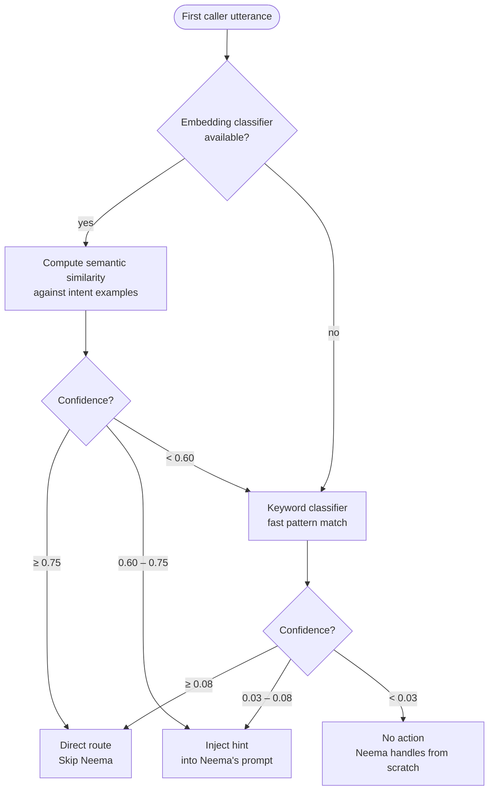

# Intent Routing

Before Neema says hello, the system has already attempted to classify what the caller wants.
This pre-call classification runs the moment the first utterance is received. Depending on
how confident the result is, the call either skips Neema entirely, gives Neema a hint, or
leaves Neema to figure it out from scratch.

The classifier lives in `src/core/intent_router.py` and `src/core/intent_embeddings.py`.

---

## The Four Intents

| Intent | What it means |
|---|---|
| `reservation` | Caller wants to book a table |
| `takeaway` | Caller wants to order food for collection |
| `checkout` | Caller wants to pay for an existing order |
| `unknown` | Intent could not be determined |

---

## Two-Stage Pipeline

Classification runs two stages in sequence. The embedding classifier runs first. If it
fails or is unavailable, the keyword classifier takes over.



---

## Stage 1 — Embedding Classifier

**Defined in:** `src/core/intent_embeddings.py`

The embedding classifier converts the caller's utterance and a set of labelled examples
into vectors, then measures how close the utterance is to each intent cluster.

### Providers

Two embedding providers are supported. The active provider is set at startup.

| Provider | Model | Cost | When used |
|---|---|---|---|
| **Local** *(default)* | `all-MiniLM-L6-v2` (Sentence Transformers) | Free, runs on-device | Default — no API call, no latency |
| **OpenAI** | `text-embedding-3-small` | ~$0.000002 per call | Fallback if local model unavailable |

The local model is preferred. It runs in-process, adds no latency, and costs nothing.
OpenAI is available as a fallback if the local model fails to load. The provider can also
be switched at runtime via `switch_provider()` without restarting the agent.

### Training examples

Each intent has **15 labelled examples** (`INTENT_EXAMPLES` in `intent_embeddings.py`).
These are embedded once at startup during `initialize()` and cached. No re-embedding
happens during calls.

### Scoring

For each utterance, the classifier computes two similarity values per intent:

- **Centroid similarity** — distance from the utterance to the average of all 15 examples
  for that intent
- **Max example similarity** — distance from the utterance to the single closest example

The final score blends both:

```
score = (0.40 × centroid_similarity) + (0.60 × max_example_similarity)
```

The intent with the highest blended score wins. The confidence value returned is that score.

### Thresholds

| Confidence | Action |
|---|---|
| ≥ 0.75 | **Direct route** — open the specialist agent immediately, skip Neema |
| 0.60 – 0.75 | **Hint** — inject intent into Neema's system prompt; Neema still greets first |
| < 0.60 | Fall through to keyword classifier |

---

## Stage 2 — Keyword Classifier

**Defined in:** `src/core/intent_router.py` → `classify_intent_keywords()`

The keyword classifier is a fast pattern-matching fallback. It scores each intent by
counting how many of its keyword patterns appear in the utterance and divides by the total
number of patterns for that intent.

No API calls, no model loading. It runs in microseconds.

### Thresholds

| Confidence | Action |
|---|---|
| ≥ 0.08 | **Direct route** — open the specialist agent, skip Neema |
| 0.03 – 0.08 | **Hint** — inject intent into Neema's system prompt |
| < 0.03 | **No action** — Neema handles from scratch |

The keyword thresholds are lower than the embedding thresholds because keyword matching
is less precise. A high keyword score is still weaker evidence than a high embedding score.

---

## What "Direct Route" and "Hint" Mean in Practice

### Direct route

The greeter is bypassed. The session opens with the specialist agent directly — Baraka for
`reservation`, Zawadi for `takeaway`. The caller's first utterance is passed as context so
the specialist can acknowledge what was said and continue from there without re-asking.

`checkout` is not currently a direct-route destination. A caller cannot arrive mid-session
at Luchetu without having gone through Zawadi first — there is no confirmed order to pay for.

### Hint

Neema still answers. The intent label and confidence score are injected into her system
prompt as an additional instruction before she speaks. For example:

> *The caller's opening statement suggests they want: reservation (confidence: 0.68).
> Route them there without asking unnecessary questions.*

Neema uses this to skip her usual open-ended "how can I help?" and go straight to routing.
The caller experiences a faster, more direct interaction even though Neema is still present.

---

## IntentResult

`classify_intent()` returns an `IntentResult` dataclass with the following fields:

| Field | Type | Description |
|---|---|---|
| `intent` | `str` | One of `reservation`, `takeaway`, `checkout`, `unknown` |
| `confidence` | `float` | Score from 0.0 to 1.0 |
| `hint` | `str \| None` | The hint string injected into Neema's prompt, if applicable |
| `method` | `str` | `"embeddings"` or `"keywords"` — which stage produced the result |
| `provider` | `str` | `"local"` or `"openai"` — which embedding provider was used |

The `method` and `provider` fields are written to the audit log on every call so intent
classification quality can be monitored over time.

---

## What Happens When Classification Fails

If both stages fail (embeddings unavailable, no keyword match above threshold), the
`IntentResult` returns `intent = "unknown"` with `confidence = 0.0` and no hint.
Neema handles the call entirely from scratch, which is the same experience as any
unaided greeter. No error is raised and the call proceeds normally.
